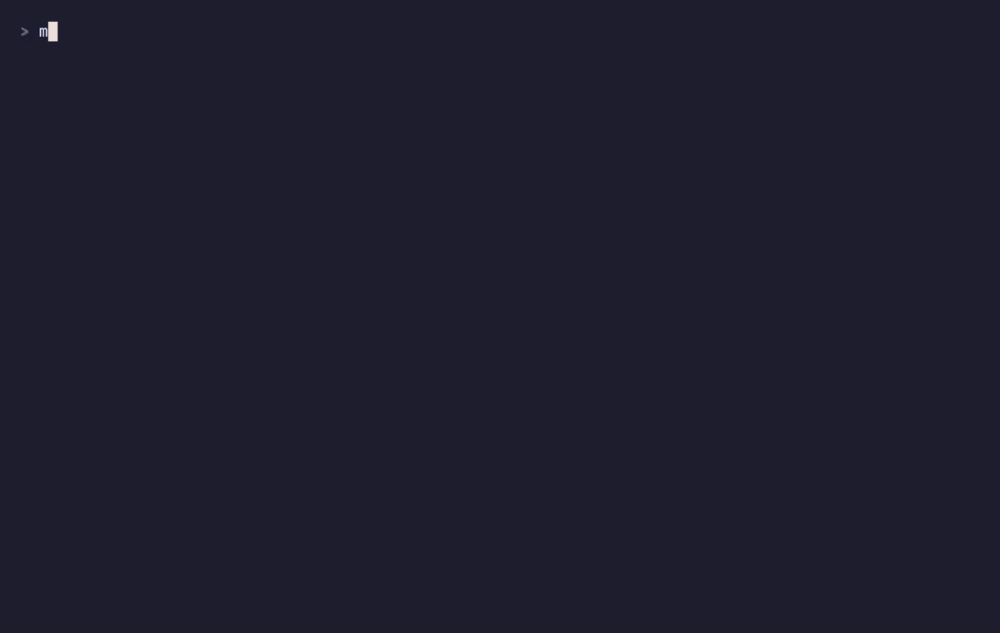

<div align="center">

<h1><picture><source media="(prefers-color-scheme: dark)" srcset=".github/assets/logos/apple-dark.svg"></picture>&nbsp; macstrap</h1>

### Bootstrap a modern macOS dev environment, in one command

[](https://github.com/XavierAgostino/macstrap/actions/workflows/ci.yml)
[](LICENSE)


Reproducible, **profile-aware** macOS setup on **chezmoi** and **mise**. One repo
for personal and work machines — secrets never committed.

<br/>


</div>

---

## How it works

Set up a Mac or fork this repo — same flow:

```text
install once → pick a profile → dotfiles + runtimes + tools → health check → maintain
```

1. **Install once** — one-liner installs Homebrew, clones the repo, links `macstrap` onto PATH.
2. **Pick a profile** — `personal` or `work` drives git identity, packages, and signing.
3. **Configure** — dotfiles ([chezmoi](https://chezmoi.io)), runtimes ([mise](https://mise.jdx.dev)), core toolchain, apps, health check. Idempotent.
4. **Add tools on demand** — `macstrap apps` / `macstrap cli`; selections replay on the next Mac.
5. **Maintain** — `macstrap doctor`, `macstrap diff`, `macstrap apply`, `macstrap update`, `macstrap report`.

Preview with `macstrap install --dry-run`. Revert with `macstrap uninstall`. Identity and keys stay in machine-local config.

## Quick start

```bash
/bin/bash -c "$(curl -fsSL https://raw.githubusercontent.com/XavierAgostino/macstrap/main/install.sh)"
```

Open a new terminal:

```bash
macstrap install              # default stack (asks: personal or work?)
macstrap install --minimal    # shell, git, chezmoi, mise, CLI core only
macstrap install --work --apps
macstrap doctor               # health check
macstrap apps                 # pick GUI apps
macstrap cli                  # pick optional project CLIs
macstrap update               # pull latest and apply
```

Full walkthrough: [`docs/SETUP.md`](docs/SETUP.md).

> [!TIP]
> Dry run: `macstrap install --dry-run`. Quiet by default — add `--verbose` for full output.

## What's installed

<p align="center"><strong>Core toolchain</strong> — chezmoi · mise · starship · ghostty · git · gh · eza · bat · fd · ripgrep · fzf · zoxide · jq · tmux · pnpm · uv · 1Password</p>

<p align="center"><strong>Default apps</strong></p>

<div align="center">
<table>
  <tr>
    <td align="center" width="104"><picture><source media="(prefers-color-scheme: dark)" srcset=".github/assets/logos/cursor-dark.svg"></picture><br/><sub><b>Cursor</b></sub></td>
    <td align="center" width="104"><br/><sub><b>VS Code</b></sub></td>
    <td align="center" width="104"><br/><sub><b>Claude Code</b></sub></td>
    <td align="center" width="104"><br/><sub><b>Ghostty</b></sub></td>
  </tr>
  <tr>
    <td align="center" width="104"><br/><sub><b>Chrome</b></sub></td>
    <td align="center" width="104"><br/><sub><b>Raycast</b></sub></td>
    <td align="center" width="104"><br/><sub><b>Rectangle</b></sub></td>
    <td align="center" width="104"><picture><source media="(prefers-color-scheme: dark)" srcset=".github/assets/logos/onepassword-dark.svg"></picture><br/><sub><b>1Password</b></sub></td>
  </tr>
  <tr>
    <td align="center" width="104"><br/><sub><b>OrbStack</b></sub></td>
    <td align="center" width="104"><br/><sub><b>TablePlus</b></sub></td>
    <td align="center" width="104"><br/><sub><b>Figma</b></sub></td>
    <td align="center" width="104"><br/><sub><b>Slack</b></sub></td>
  </tr>
  <tr>
    <td align="center" width="104"><br/><sub><b>Zoom</b></sub></td>
    <td align="center" width="104"><br/><sub><b>Notion</b></sub></td>
    <td align="center" width="104"><br/><sub><b>Obsidian</b></sub></td>
    <td align="center" width="104"><br/><sub><b>Spotify</b></sub></td>
  </tr>
</table>
</div>

<p align="center">Customize via <code>brew/Brewfile.{core,apps,personal,work}</code> · full list in <a href="docs/SETUP.md#7-default-toolchain-and-apps">SETUP §7</a></p>

### The TUI

Run `macstrap` with no arguments — dashboard, Doctor, searchable Apps/CLI pickers,
Report, Security, Logs, and an Install dry-run preview.

```bash
macstrap            # interactive dashboard
macstrap doctor     # scriptable — add --json for machines
macstrap logs       # step logs from the last run
```

<div align="center">

</div>

## See it in action

<p align="center">Scripted walkthroughs — <code>macstrap demo &lt;name&gt;</code> installs nothing.</p>

<div align="center">
<table>
  <tr>
    <th>Demo</th>
    <th>Command</th>
  </tr>
  <tr>
    <td align="center">Setup preview</td>
    <td align="center"><code>macstrap demo</code></td>
  </tr>
  <tr>
    <td align="center">App picker</td>
    <td align="center"><code>macstrap demo apps</code></td>
  </tr>
  <tr>
    <td align="center">CLI picker</td>
    <td align="center"><code>macstrap demo cli</code></td>
  </tr>
  <tr>
    <td align="center">Doctor</td>
    <td align="center"><code>macstrap demo doctor</code></td>
  </tr>
</table>
</div>

<p align="center"><strong>App picker</strong></p>

<div align="center">

</div>

<p align="center"><strong>CLI picker</strong></p>

<div align="center">

</div>

<p align="center"><strong>Doctor</strong></p>

<div align="center">

</div>

<p align="center">
CLI catalog: <a href="docs/SETUP.md#6-optional-clis-per-project-not-per-machine">SETUP §6</a> ·
Regenerate GIFs: <a href="docs/DEMOS.md">DEMOS.md</a>
</p>

<details>
<summary><b>Manual setup and env vars</b></summary>

```bash
/bin/bash -c "$(curl -fsSL https://raw.githubusercontent.com/Homebrew/install/HEAD/install.sh)"
eval "$(/opt/homebrew/bin/brew shellenv)"
git clone https://github.com/XavierAgostino/macstrap.git ~/Developer/workspaces/macstrap
bash ~/Developer/workspaces/macstrap/scripts/bootstrap.sh
```

Env vars for agents and CI: `MODE=minimal|default|interactive|headless|doctor`,
`PROFILE=personal|work`, `APPS=0|default|interactive|a,b,c`, `DRY_RUN=1`.
Example: `PROFILE=work APPS=cursor,orbstack bash scripts/bootstrap.sh`.
See [`docs/AGENT-USAGE.md`](docs/AGENT-USAGE.md).

</details>

## Profiles (personal vs work)

One profile at `chezmoi init` drives git identity, Brewfiles, and signing —
[`docs/work-separation.md`](docs/work-separation.md).

> [!IMPORTANT]
> With signing enabled, **1Password must be unlocked** to commit. Bypass once with
> `git commit --no-gpg-sign`.

## Make it yours

1. Fork this repo.
2. Edit `brew/Brewfile.*`, `dot_config/*`, and `ai/*`.
3. Run `REPO_SLUG=you/macstrap bash scripts/bootstrap.sh`.

Name, email, and signing keys live in machine-local chezmoi config — never committed.

## Maintenance

```bash
macstrap report        # what macstrap manages
macstrap security      # secrets, signing, hook posture
macstrap doctor --json # machine-readable health
macstrap uninstall     # dry-run back-out (--apply to perform)
```

`uninstall.sh` backs up before removing; it never touches Homebrew packages, 1Password, runtimes, or your data.

## Documentation

<div align="center">
<table>
  <tr>
    <th>If you…</th>
    <th>Start here</th>
  </tr>
  <tr>
    <td align="center">Just installed</td>
    <td align="center"><a href="docs/SETUP.md">SETUP.md</a></td>
  </tr>
  <tr>
    <td align="center">Work laptop</td>
    <td align="center"><a href="docs/work-separation.md">work-separation.md</a></td>
  </tr>
  <tr>
    <td align="center">Fork / customize</td>
    <td align="center"><a href="docs/README.md">docs/README.md</a></td>
  </tr>
  <tr>
    <td align="center">Automate / agent</td>
    <td align="center"><a href="docs/AGENT-USAGE.md">AGENT-USAGE.md</a></td>
  </tr>
  <tr>
    <td align="center">Something broke</td>
    <td align="center"><a href="docs/TROUBLESHOOTING.md">TROUBLESHOOTING.md</a></td>
  </tr>
</table>
</div>

## License

[MIT](LICENSE)
