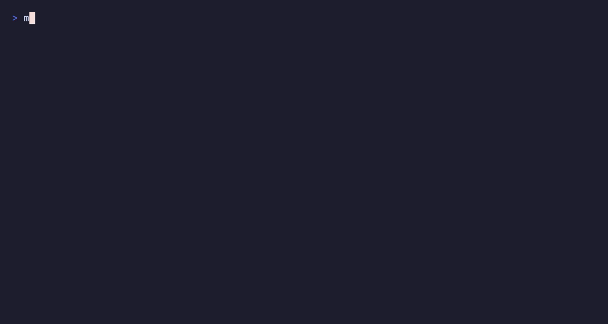

<div align="center">

<h1><picture><source media="(prefers-color-scheme: dark)" srcset=".github/assets/logos/apple-dark.svg"></picture>&nbsp; macstrap</h1>

### Bootstrap a modern macOS dev environment, in one command

[](https://github.com/XavierAgostino/macstrap/actions/workflows/ci.yml)
[](LICENSE)


A reproducible, **profile-aware** macOS setup built on **chezmoi** and **mise**.
Secrets stay out of git, work and personal machines stay cleanly separated, and a
brand-new Mac is fully configured in minutes.

<br/>


</div>

---

## How it works

Two paths: **set up a Mac**, or **fork it as your own setup**. Either way the flow is the same:

```text
install once → pick a profile → dotfiles + runtimes + tools → health check → maintain
```

1. **Install once** — the one-liner installs Homebrew, clones the repo, and links the `macstrap` CLI onto your PATH.
2. **Pick a profile** — `personal` or `work`, chosen once at setup. It drives your git identity, commit signing, and which packages install — so you never have to remember to switch your git email later.
3. **macstrap configures the machine** — previews, then applies your dotfiles ([chezmoi](https://chezmoi.io)), installs runtimes ([mise](https://mise.jdx.dev)) and the core toolchain, adds your chosen apps, then runs a health check. Idempotent and safe to re-run.
4. **Add optional tools when a project needs them** — `macstrap apps` for GUI apps, `macstrap cli` for project CLIs (Supabase, Stripe, AWS…). CLI picks are recorded, so a fresh Mac replays them.
5. **Maintain it** — `macstrap doctor` / `diff` / `apply` / `update` / `report` keep it a living environment, not a one-shot script.

Every run is previewable (`--dry-run`), reversible (`macstrap uninstall`), and scriptable (env vars for CI/agents). Your name, email, and keys live in machine-local config — **never committed**.

## Quick start

One line installs Homebrew, clones the repo, sets everything up, and links the
`macstrap` command onto your PATH:

```bash
/bin/bash -c "$(curl -fsSL https://raw.githubusercontent.com/XavierAgostino/macstrap/main/install.sh)"
```

Open a new terminal, and you have the `macstrap` CLI:

```bash
macstrap install              # default stack (asks: personal or work?)
macstrap install --minimal    # shell, git, chezmoi, mise, CLI core only
macstrap install --work --apps
macstrap doctor               # health check
macstrap apps                 # pick GUI apps interactively
macstrap cli                  # pick optional project CLIs (Supabase, Vercel, ...)
macstrap update               # pull the latest and apply
macstrap diff                 # preview pending changes
```

> [!TIP]
> Preview any run without touching your machine: `macstrap install --dry-run`.
> Run `macstrap help` for the full command list.

`macstrap apps` (and `macstrap install --apps`) let you pick exactly what to install:

<div align="center">

</div>

The core stays lean on purpose. When a project needs them, pull in optional CLIs
by group or by name — the picker records your choice so a fresh Mac replays it:

```bash
macstrap cli                  # interactive, grouped picker
macstrap cli backend,ai       # install whole groups
macstrap cli supabase,stripe  # install exact tools
macstrap cli --list           # browse the catalog
```

Groups: `deploy` · `backend` · `database` · `cloud` · `kubernetes` · `infra` ·
`security` · `ai` · `api` · `power-user`. See [`docs/SETUP.md`](docs/SETUP.md) for
the full catalog.

<div align="center">

</div>

## See it in action

Every demo is a scripted, non-mutating walkthrough — watch any of them yourself
with `macstrap demo <name>` (it installs nothing):

| Demo | Shows | Watch |
| --- | --- | --- |
| Setup preview | The dry-run plan before macstrap touches your machine | `macstrap demo` |
| App picker | Choose exactly which GUI apps to install | `macstrap demo apps` |
| CLI picker | Add project CLIs (Supabase, Stripe, AWS…) on demand | `macstrap demo cli` |
| Doctor | Verify Homebrew, chezmoi, mise, runtimes, 1Password, signing | `macstrap demo doctor` |

<div align="center">

</div>

> The README GIFs are generated from [`demo/tapes/`](demo/tapes) with VHS, not
> hand-recorded — see [`docs/DEMOS.md`](docs/DEMOS.md) to regenerate them.

<details>
<summary><b>Manual setup and advanced env vars</b></summary>

Prefer to see each step, or automating without the CLI:

```bash
# Homebrew (also installs git via Xcode CLT)
/bin/bash -c "$(curl -fsSL https://raw.githubusercontent.com/Homebrew/install/HEAD/install.sh)"
eval "$(/opt/homebrew/bin/brew shellenv)"

# Clone and bootstrap
git clone https://github.com/XavierAgostino/macstrap.git ~/Developer/workspaces/macstrap
bash ~/Developer/workspaces/macstrap/scripts/bootstrap.sh
```

The CLI just sets env vars, which agents and CI can pass directly:
`MODE=minimal|default|interactive|headless|doctor`, `PROFILE=personal|work`,
`APPS=0|default|interactive|a,b,c` (groups or keys from `brew/apps.catalog`),
`DRY_RUN=1`. For example
`PROFILE=work APPS=cursor,orbstack,tableplus bash scripts/bootstrap.sh`.

Optional CLIs live in `brew/cli.catalog`; `macstrap cli …` installs them and
records the selection in `brew/selected.cli`, which the installer replays on the
next machine. See [`docs/AGENT-USAGE.md`](docs/AGENT-USAGE.md).

</details>

## What you get

- **Modern shell**: zsh with the [Starship](https://starship.rs) prompt,
  autosuggestions, syntax highlighting, and a clean modular config.
- **One runtime manager**: [mise](https://mise.jdx.dev) handles Node, Python and
  more *per project* (`.nvmrc` / `.tool-versions` aware). No nvm/pyenv soup.
- **A great CLI toolbox**: `eza`, `bat`, `fd`, `ripgrep`, `fzf`, `zoxide`,
  `delta`, `jq`, `tmux`, preconfigured.
- **Optional CLI catalog**: pull in project tools (Supabase, Stripe, AWS,
  `kubectl`…) on demand with `macstrap cli` — recorded, so a fresh Mac replays
  your picks.
- **Terminal**: [Ghostty](https://ghostty.org) with a tuned config.
- **Personal and work profiles**: one repo; the right identity, packages, and
  commit signing per machine, chosen at setup.
- **Secrets done right**: [1Password](https://1password.com) integration plus a
  `gitleaks` pre-commit hook, so a credential can never land in git.
- **Signed commits**: SSH commit signing via 1Password (the verified badge on GitHub).
- **AI assistant config**: a starter `CLAUDE.md` / `AGENTS.md` for Claude Code,
  Codex, and Cursor.
- **macOS defaults**: an opt-in script for sensible Finder, keyboard, and
  screenshot preferences.
- **Tested in CI**: shellcheck and a chezmoi render check on every push.

## What's installed

**Toolchain (always):** `chezmoi` · `mise` · `starship` · `ghostty` · `zsh`
(+ autosuggestions & syntax-highlighting) · `git` + `delta` · `gh` · `eza` ·
`bat` · `fd` · `ripgrep` · `fzf` · `zoxide` · `jq` · `tmux` · `pnpm` · `uv` ·
`1password` + `1password-cli`

**Apps** installed out of the box:

<div align="center">
<table>
  <tr>
    <td align="center" width="104"><picture><source media="(prefers-color-scheme: dark)" srcset=".github/assets/logos/cursor-dark.svg"></picture><br/><sub><b>Cursor</b></sub></td>
    <td align="center" width="104"><br/><sub><b>VS Code</b></sub></td>
    <td align="center" width="104"><br/><sub><b>Claude Code</b></sub></td>
    <td align="center" width="104"><br/><sub><b>Ghostty</b></sub></td>
  </tr>
  <tr>
    <td align="center" width="104"><br/><sub><b>Chrome</b></sub></td>
    <td align="center" width="104"><br/><sub><b>Raycast</b></sub></td>
    <td align="center" width="104"><br/><sub><b>Rectangle</b></sub></td>
    <td align="center" width="104"><picture><source media="(prefers-color-scheme: dark)" srcset=".github/assets/logos/onepassword-dark.svg"></picture><br/><sub><b>1Password</b></sub></td>
  </tr>
  <tr>
    <td align="center" width="104"><br/><sub><b>OrbStack</b></sub></td>
    <td align="center" width="104"><br/><sub><b>TablePlus</b></sub></td>
    <td align="center" width="104"><br/><sub><b>Figma</b></sub></td>
    <td align="center" width="104"><br/><sub><b>Slack</b></sub></td>
  </tr>
  <tr>
    <td align="center" width="104"><br/><sub><b>Zoom</b></sub></td>
    <td align="center" width="104"><br/><sub><b>Notion</b></sub></td>
    <td align="center" width="104"><br/><sub><b>Obsidian</b></sub></td>
    <td align="center" width="104"><br/><sub><b>Spotify</b></sub></td>
  </tr>
</table>
</div>

> [!TIP]
> Edit `brew/Brewfile.{core,apps,personal,work}` to make the toolset yours.
> `Brewfile.apps` has more options commented out.

## Structure

```text
macstrap/
├── bin/macstrap                  # the CLI (symlinked to ~/.local/bin)
├── private_dot_zshrc.tmpl        # -> ~/.zshrc       (chezmoi templates)
├── dot_config/                   # -> ~/.config/*    (starship, ghostty, mise, zsh, git)
├── dot_gitconfig.tmpl            # -> ~/.gitconfig   (identity from profile)
├── brew/                         # Brewfile.{core,apps,personal,work,dev}
│                                 #   + apps.catalog, cli.catalog, selected.cli
├── scripts/                      # bootstrap, cli, doctor, report, uninstall, security, lib/, hooks/
├── demo/                         # scripted walkthroughs + VHS tapes (macstrap demo)
├── ai/                           # AI assistant config (Claude / Codex / Cursor)
├── docs/                         # setup, decisions, troubleshooting, work/personal, agents, demos
└── .github/workflows/ci.yml
```

## Profiles (personal vs work)

`chezmoi init` asks for a **profile** and identity. That one choice drives your
git identity, which Brewfiles install, and commit signing, so the same repo
configures a personal laptop and a locked-down work machine correctly. See
[`docs/work-separation.md`](docs/work-separation.md).

> [!IMPORTANT]
> With signing enabled, commits are signed through 1Password, so **1Password must
> be unlocked** to commit (a quick Touch ID prompt). Bypass a single commit with
> `git commit --no-gpg-sign`.

## Make it yours

1. Fork this repo.
2. Edit the Brewfiles, `dot_config/*`, and `ai/*` to taste.
3. Run `REPO_SLUG=you/macstrap bash scripts/bootstrap.sh` (or clone your fork and
   run the bootstrap).

> [!NOTE]
> Your name, email, and signing key are **never committed**: they live in
> machine-local chezmoi config, so a fork is generic by default.

## Maintenance and safety

Every action is previewable and reversible:

```bash
macstrap report        # what macstrap manages on this machine
macstrap security      # secrets, signing, hook, op/gh posture
macstrap doctor --json # machine-readable health
macstrap uninstall     # dry-run back-out of managed dotfiles (--apply to perform)
```

`uninstall.sh` backs up every file before removing it and never touches Homebrew
packages, 1Password, runtimes, or your data.

## Why it's built this way

See [`docs/DECISIONS.md`](docs/DECISIONS.md) for short notes on why chezmoi over
symlinks, mise over nvm/pyenv, profiles over branches, and more.

## Docs

- [`docs/SETUP.md`](docs/SETUP.md): detailed setup and the optional CLI catalog
- [`docs/DECISIONS.md`](docs/DECISIONS.md): design rationale
- [`docs/TROUBLESHOOTING.md`](docs/TROUBLESHOOTING.md): fixes and recovery
- [`docs/work-separation.md`](docs/work-separation.md): profiles, signing, compliance
- [`docs/AGENT-USAGE.md`](docs/AGENT-USAGE.md): driving macstrap from CI or an agent
- [`docs/DEMOS.md`](docs/DEMOS.md): how the demos and README GIFs are generated
- [`docs/COLORS.md`](docs/COLORS.md): the Vesper color language
- [`docs/adr/`](docs/adr/): architecture decision records

## License

[MIT](LICENSE): fork it, ship it, make it yours.
