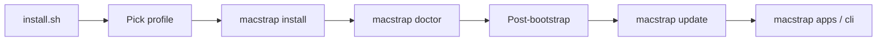

# Documentation

Start with the [README](../README.md) for the one-liner and GIFs. Pick a path below.

## New install

1. [README](../README.md) — one-liner and quick start
2. [SETUP.md](SETUP.md) — full walkthrough (steps 1–5)
3. [SETUP.md §5](SETUP.md#5-post-bootstrap) — post-bootstrap checklist (1Password, GitHub, signing)
4. [work-separation.md](work-separation.md) — if this is a work laptop



## Guides

| If you… | Read |
| --- | --- |
| Just installed | [SETUP.md](SETUP.md) |
| Work laptop | [work-separation.md](work-separation.md) — profiles, signing, compliance |
| Something broke | [TROUBLESHOOTING.md](TROUBLESHOOTING.md) |

## Customize

| Topic | Doc |
| --- | --- |
| Toolchain, apps, CLI catalog | [SETUP.md](SETUP.md) §6–§7 |
| Terminal colors | [COLORS.md](COLORS.md) |
| AI assistant config | [ai/README.md](../ai/README.md) |
| Design rationale | [DECISIONS.md](DECISIONS.md) → [adr/](adr/) |

## Automate

| Topic | Doc |
| --- | --- |
| Agents and CI | [AGENT-USAGE.md](AGENT-USAGE.md) |
| JSON schemas | [JSON-CONTRACTS.md](JSON-CONTRACTS.md) |

## Contribute

| Topic | Doc |
| --- | --- |
| Demos and README GIFs | [DEMOS.md](DEMOS.md) |

## Repo layout

```text
macstrap/
├── bin/macstrap                  # CLI (symlinked to ~/.local/bin)
├── private_dot_zshrc.tmpl        # chezmoi templates → ~/.zshrc
├── dot_config/                   # → ~/.config/* (starship, ghostty, mise, git)
├── dot_gitconfig.tmpl            # → ~/.gitconfig (identity from profile)
├── brew/                         # Brewfile.{core,apps,personal,work,dev}
│                                 #   + apps.catalog, cli.catalog, selected.cli
├── scripts/                      # bootstrap, doctor, report, uninstall, lib/, hooks/
├── demo/                         # scripted walkthroughs + VHS tapes
├── ai/                           # Claude / Codex / Cursor starter config
└── docs/                         # you are here
```
